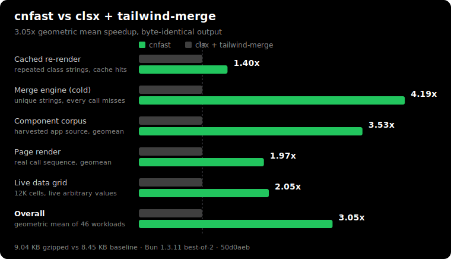

# cnfast

[](https://npmjs.com/package/cnfast)
[](https://npmjs.com/package/cnfast)

Fast drop-in replacement for `cn`.

cnfast runs **3.1x faster** on average than `clsx` + `tailwind-merge` (up to 4.4x), with byte-identical output. Same API, no code changes.

```ts
import { cn } from "cnfast";

cn("px-2 py-1", isActive && "px-4", { "text-red-500": hasError });
// "py-1 px-4 text-red-500"
```

## Install

```bash
npm install cnfast
```

Migrate an existing `clsx`, `classnames`, or `tailwind-merge` project in one command:

```bash
npx cnfast migrate
```

On a shadcn/ui project, add or replace your `cn` utility through the registry. This rewrites `lib/utils.ts` to re-export cnfast and installs the package:

```bash
npx shadcn@latest add aidenybai/cnfast/cn
```

## Usage

Swap the shadcn/ui `cn` helper for cnfast:

```ts
// before
import { clsx, type ClassValue } from "clsx";
import { twMerge } from "tailwind-merge";
export const cn = (...inputs: ClassValue[]) => twMerge(clsx(inputs));

// after
export { cn } from "cnfast";
```

cnfast also exports `clsx`, `twMerge`, and `twJoin`.

## Going even faster

As a tagged template, `cn` caches by call-site identity: a stable call site runs 3.5x faster than the `cn(...)` call form and 7x faster than `clsx` + `tailwind-merge`.

```ts
cn`px-2 px-4 ${isActive && "bg-blue-500"}`; // "px-4 bg-blue-500"
```

## Comparing against cn

cnfast produces byte-identical output to `clsx` + `tailwind-merge`, then does that work faster. Throughput on Bun, best-of-3:



| Workload           | clsx + tailwind-merge | cnfast      | Speedup   |
| ------------------ | --------------------- | ----------- | --------- |
| Cached re-render   | 1,580 ops/s           | 2,206 ops/s | **1.40x** |
| Merge engine, cold | 485 ops/s             | 2,125 ops/s | **4.39x** |
| Component corpus   | 1,655 ops/s           | 5,732 ops/s | **3.46x** |
| Page render        | 1,295 ops/s           | 2,587 ops/s | **2.00x** |
| Live data grid     | 11 ops/s              | 29 ops/s    | **2.50x** |

Across 59 workloads the geometric mean is **3.12x**, with 0 mismatches over 30,127 real-world call groups. The bundle is 9.04 KB gzipped against 8.45 KB for the baseline.

`cn` runs once per element, so its cost scales with how much you render. Server-rendering a large page calls it across the whole tree, and a client app that re-renders often (data grids, virtualized tables, live dashboards) calls it thousands of times per second. A faster `cn` keeps those busy frames inside budget. On a small or rarely-updated page, the saving disappears into noise.

The chart regenerates in CI on every library change. See the [benchmark suite](./packages/fastcn/bench/README.md) for the full breakdown and the [architecture guide](./docs/architecture.md) for how it works.

## Development

```bash
pnpm install
pnpm build
pnpm test
```

## Credits

cnfast adapts MIT-licensed code from [clsx](https://github.com/lukeed/clsx) (Luke Edwards) and [tailwind-merge](https://github.com/dcastil/tailwind-merge) (Dany Castillo). See [LICENSE](./LICENSE).

## License

MIT
